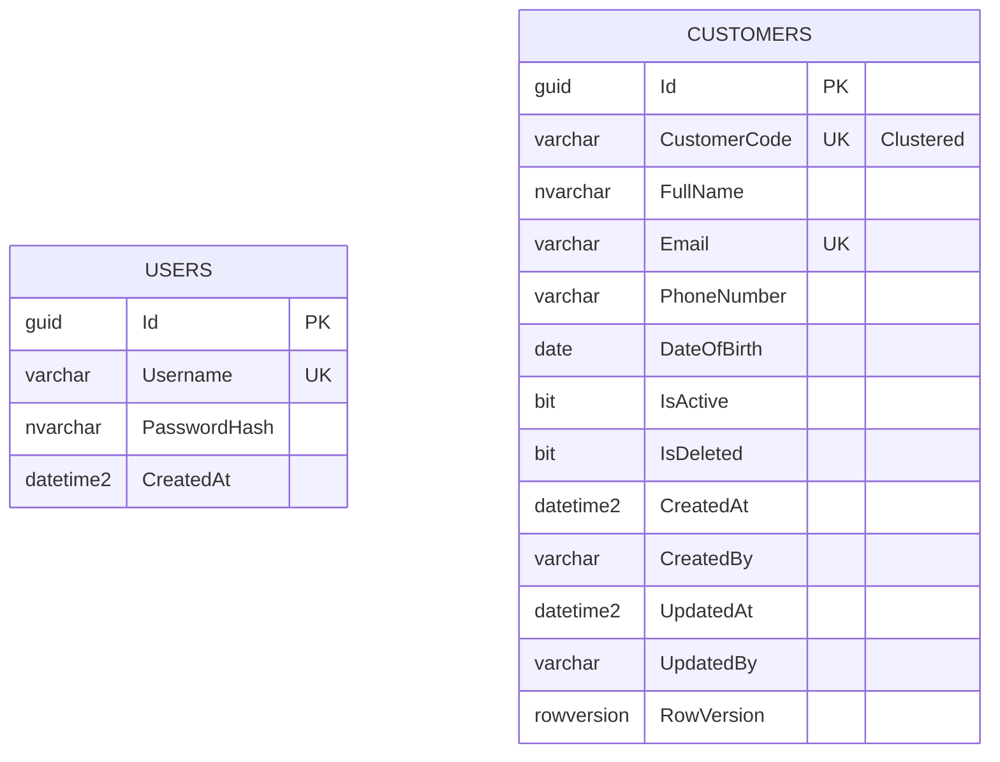

# Mini Customer Management System — Phase 1: Analysis & Design (v2)

**Phase:** Analysis only — chưa có code.
**Revision:** v2 — tích hợp báo cáo thiết kế chuyên sâu do bạn cung cấp, thay thế/giải quyết các mục còn treo ở v1.
**Ngày:** 2026-09-15

---

## 0.1 Ghi chú v3 — cập nhật theo hướng dẫn triển khai (naming, endpoint, JWT storage)

- **Namespace/project naming:** chốt theo tên bạn chỉ định — `CustomerManager.Domain`, `CustomerManager.Application`, `CustomerManager.Infrastructure`, `CustomerManager.WebApi`, `CustomerManager.Blazor` — thay cho `CustomerManagement.*` dùng trong bản nháp v1/v2. Toàn bộ code từ Phase 2 trở đi dùng namespace này; các sơ đồ cây thư mục ở mục 7-8 giữ nguyên cấu trúc bên trong, chỉ đổi tên project gốc.
- **Endpoint `/api/auth/login`, `/api/customers*`:** khớp với thiết kế đã chốt ở mục 6 (chỉ khác là không còn prefix `/v1/` — chấp nhận bỏ versioning cho Mini Project, thêm sau nếu cần qua URL path hoặc header, không phải rework lớn).
- **`PUT /api/customers/{id}` kèm `RowVersion`:** đã đúng như thiết kế RowVersion/Optimistic Concurrency ở mục 5.2/9.
- **`DELETE` → Interceptor chặn xóa vật lý, chuyển `IsDeleted=true`:** đúng như `SoftDeleteAndAuditInterceptor` đã thiết kế ở mục 7.
- **⚠️ JWT lưu ở Local Storage (điểm cần bạn xác nhận):** hướng dẫn mới yêu cầu `CustomAuthStateProvider` đọc JWT từ `localStorage`. Ở v2 tôi đã khuyến nghị **không** dùng `localStorage` cho token vì rủi ro XSS (bất kỳ script nào chèn được vào trang — kể cả qua 1 thư viện third-party lỗi — đều đọc được token trực tiếp từ `localStorage`, trong khi giữ token trong bộ nhớ JS thuần thì khó bị đọc hơn nhiều). Đây là hệ thống tài chính nên tôi giữ nguyên khuyến nghị: ưu tiên lưu token trong bộ nhớ (in-memory state service), chấp nhận mất phiên khi F5. Nếu bạn vẫn muốn `localStorage` để giữ phiên qua reload (`ProtectedLocalStorage` — API bạn đề cập), tôi sẽ triển khai theo đúng hướng dẫn, nhưng cần bạn xác nhận chấp nhận trade-off bảo mật này — xem câu hỏi bên dưới.

---

## 0. Ghi chú thay đổi so với v1 (Revision Note)

Báo cáo bạn gửi đưa ra một số quyết định kiến trúc sâu hơn và **thay thế trực tiếp** các mục "CẦN XÁC NHẬN" ở v1. Với tư cách reviewer, tôi giữ lại phần lớn đề xuất vì hợp lý cho hệ thống tài chính, nhưng có 4 điểm tôi điều chỉnh nhẹ để tránh over-engineering hoặc vá lỗ hổng thiết kế — nêu rõ ở mục 16 (Technical Decisions). Tóm tắt các thay đổi chính:

| Mục | v1 | v2 (sau khi tích hợp) |
|---|---|---|
| 18.1 Soft delete | Đề xuất, chờ xác nhận | **Chốt: soft delete**, tự động hóa qua `SaveChangesInterceptor` + Global Query Filter |
| 18.2 Unique Email/Phone | Mặc định không unique | **Chốt: Email unique, Phone không unique** (chỉ Index) |
| Customer.Id | `int identity` | **`GUID` (uniqueidentifier)** — chống IDOR/ID-guessing, không clustered nên không lo phân mảnh |
| Clustered index | Trên `Id` | **Trên `CustomerCode`** (business key, gần tuần tự) |
| Users table | Không có (admin từ config) | **Có bảng `Users`**, nhưng seed 1 admin duy nhất lúc khởi động (không có UI đăng ký) — vẫn giữ tinh thần "tài khoản cứng" |
| Repository pattern | `ICustomerRepository` + `CustomerRepository` | **Bỏ Repository generic**, Service tầng Application thao tác qua interface `IApplicationDbContext` mỏng (xem 16.7) |
| Response format | Custom `ApiResponse<T>` envelope | **RFC 7807 ProblemDetails** cho lỗi; response thành công trả thẳng DTO/status code |
| Audit | Bảng `CustomerAuditLogs` riêng (Should Have) | **`CreatedBy/UpdatedBy` trực tiếp trên `Customer`** (last-write audit); `CustomerAuditLogs` hạ xuống "Nice to have" nếu cần full history |
| Caching | Không có | **Output Caching + Redis (optional/pluggable)** cho `GET /customers`, có invalidation theo tag khi ghi |
| Estimation | Bảng 15 dòng, ~46h | **Thay bằng WBS 9 hạng mục, ~46h** (bạn cung cấp) |

---

## 1. Executive Summary

Hệ thống quản lý khách hàng cho môi trường tài chính/ngân hàng: ASP.NET Core 8 Web API (Layered/Clean Architecture rút gọn, không Repository generic) + Blazor WebAssembly + MudBlazor + SQL Server/EF Core 8 Code-First. Bảo mật theo tinh thần ISO 27001/PCI DSS (không claim đã đạt chứng nhận — đây là kim chỉ nam thiết kế): JWT stateless, password hash, rate limiting, ProblemDetails không lộ chi tiết lỗi, audit trail, optimistic concurrency.

---

## 2. Requirement Analysis

### 2.1 Functional Requirements

| ID | Chức năng | Mô tả | Actor | Priority |
|---|---|---|---|---|
| F01 | Login | Đăng nhập admin (tài khoản seed sẵn trong DB), nhận JWT | Admin | Bonus (đưa vào scope) |
| F02 | Logout | Xóa token phía client, quay lại Login | Admin | Should |
| F03 | Customer List | Danh sách phân trang server-side | Admin | Must |
| F04 | Search | Tìm theo Họ tên/SĐT (debounce) | Admin | Must |
| F05 | Filter | Lọc theo trạng thái hoạt động | Admin | Should |
| F06 | Create | Thêm khách hàng qua MudDialog | Admin | Must |
| F07 | Update | Cập nhật qua MudDialog | Admin | Must |
| F08 | Delete | Xóa mềm khách hàng | Admin | Must |
| F09 | Validation | Validate 2 lớp (client FluentValidation UX + server là tuyến cuối) | Admin | Must |
| F10 | Duplicate detection | Chặn trùng CustomerCode, Email | System | Must |
| F11 | Concurrency conflict handling | Cảnh báo khi 2 admin sửa cùng bản ghi | Admin | Should |

### 2.2 Non-Functional Requirements

Performance (server-side pagination, output caching có kiểm soát invalidation), Security (JWT + password hash, rate limiting, không lộ chi tiết lỗi), Maintainability (không Repository thừa, DTO tách Entity, unit/integration test), Data integrity (CustomerCode + Email unique, RowVersion concurrency, audit CreatedBy/UpdatedBy, UTC timestamp toàn hệ thống), Compliance mindset (không hard delete dữ liệu tài chính, dấu vết người thao tác).

---

## 3. UI Analysis

Hệ thống SPA gồm **3 khu vực giao diện chính**; Create/Edit và Delete-confirm là **dialog** (không phải route riêng) để giữ luồng thao tác liền mạch.

| Nhóm chức năng | Chức năng | Màn hình/Thành phần | Ghi chú kỹ thuật |
|---|---|---|---|
| Xác thực & Phân quyền | Login, Logout | Login View | JWT stateless, `CustomAuthStateProvider` giải mã claims, không dùng Cookie/Session |
| Quản lý dữ liệu | Danh sách, Search, Filter | Customer List (Dashboard) | `MudDataGrid` với `ServerData`, debounce tìm kiếm, phân trang server-side |
| Thao tác chi tiết | Create, Update, Delete, Validation | Add/Edit Dialog (`MudDialog`), Delete Confirm Dialog | `EditForm` + FluentValidation, Snackbar báo kết quả |
| Layout dùng chung | Điều hướng, hiển thị user hiện tại | MainLayout / NavMenu | Ẩn menu CRUD nếu chưa authenticate |

Xem chi tiết khách hàng: gộp vào Add/Edit Dialog ở chế độ read-only (mở dialog, disable field) thay vì thêm 1 route riêng — giảm 1 trang không cần thiết, đúng tinh thần KISS.

---

## 4. User Flow

```
Login: nhập username/password → POST /auth/login → sai: 401 (ProblemDetails, không lộ "user không tồn tại" vs "sai password") → đúng: JWT lưu trong bộ nhớ (không localStorage do XSS risk — xem 9) → CustomAuthStateProvider cập nhật → redirect Customer List

Create: List → nút "Thêm mới" → mở MudDialog (mode=Create) → FluentValidation client-side → POST /customers
  → trùng CustomerCode/Email: 409 ProblemDetails → hiển thị lỗi trong dialog
  → OK: 201 → đóng dialog → EvictByTagAsync("customers") phía server đã invalidate cache → refresh grid + Snackbar

Update: List → click dòng → mở MudDialog (mode=Edit, preload kèm RowVersion) → PUT /customers/{id} (kèm RowVersion gốc)
  → RowVersion lệch (người khác đã sửa): 409 DbUpdateConcurrencyException → Snackbar "Dữ liệu đã thay đổi, vui lòng tải lại"
  → OK: 200 → đóng dialog → invalidate cache → refresh grid

Delete: List → click Delete → Delete Confirm Dialog
  → Yes → DELETE /customers/{id} → Interceptor set IsDeleted=true, Modified → 204 → invalidate cache → refresh grid
  → No → đóng dialog

Search/Filter: gõ từ khóa (debounce ~400ms) hoặc chọn filter → MudDataGrid gọi ServerData
  → GET /customers?fullName=&phoneNumber=&isActive=&pageNumber=&pageSize=&sortBy= → Global Query Filter tự loại IsDeleted=true → IQueryable filter/sort/paginate tại SQL Server
```

---

## 5. Database Design

### 5.1 Bảng `Users` (mới — thay cho admin cứng trong config)

| Field | Type | Constraint | Ghi chú |
|---|---|---|---|
| Id | uniqueidentifier | PK, non-clustered | GUID chống ID-guessing |
| Username | varchar(50) | Unique Index, Required | |
| PasswordHash | nvarchar(max) | Required | Xem 9.1 về thuật toán hash |
| CreatedAt | datetime2 | Required, UTC | |

**Seed:** không migration `HasData()` với hash cố định commit vào Git. Thay vào đó, một `IHostedService` (`AdminUserSeeder`) chạy lúc startup: nếu `Users` rỗng, đọc `AdminSeed:Username`/`AdminSeed:Password` từ User Secrets/Environment Variable, hash bằng `PasswordHasher<T>`, insert 1 dòng duy nhất. Không có API đăng ký — đúng tinh thần "tài khoản admin cứng" nhưng không để lộ hash/plaintext trong lịch sử Git.

### 5.2 Bảng `Customers`

| Field | Type | Null | PK/Index | Default | Ghi chú |
|---|---|---|---|---|---|
| Id | uniqueidentifier | No | PK (non-clustered) | `NEWID()` | Không dùng làm clustered nên không lo phân mảnh |
| CustomerCode | varchar(20) | No | **Clustered, Unique** | server-generated (`KH-0001`) | Business key, gần tuần tự theo thời gian tạo → phù hợp làm clustered key |
| FullName | nvarchar(100) | No | Non-clustered index | — | Unicode cho tên tiếng Việt |
| Email | varchar(150) | No | **Unique index** | — | Chuẩn hóa lowercase trước khi lưu/so sánh |
| PhoneNumber | varchar(15) | No | Non-clustered index | — | Không unique (xem 16.3) |
| DateOfBirth | date | No | — | — | Validate quá khứ, tuổi hợp lý |
| IsActive | bit | No | — | 1 | |
| IsDeleted | bit | No | Filtered index `WHERE IsDeleted=0` | 0 | Do Interceptor set, không set thủ công trong Service |
| CreatedAt | datetime2 | No | — | UTC, do Interceptor set | |
| CreatedBy | varchar(50) | No | — | Username từ JWT claim, do Interceptor set | |
| UpdatedAt | datetime2 | Yes | — | UTC, do Interceptor set | |
| UpdatedBy | varchar(50) | Yes | — | Username từ JWT claim, do Interceptor set | |
| RowVersion | rowversion | No (auto) | Concurrency token | auto | Bắt buộc — optimistic concurrency |

**Không có FK giữa `Users` và `Customers`:** `CreatedBy/UpdatedBy` lưu username dạng chuỗi (denormalized), không FK sang `Users.Id`, để tránh join không cần thiết khi chỉ có 1 admin — nếu sau này có nhiều user/role, cân nhắc đổi sang FK + `Include`.

**`CustomerAuditLogs` (Nice to have, hạ ưu tiên so với v1):** chỉ cần nếu compliance yêu cầu lưu **toàn bộ lịch sử** thay đổi (không chỉ lần sửa cuối). Với `CreatedBy/UpdatedBy` đã đủ cho phần lớn yêu cầu audit tối thiểu của Mini Project.

### 5.3 Index Design

- `IX_Customers_CustomerCode` — Clustered, Unique (đồng thời là clustered key).
- `IX_Customers_Email` — Unique, non-clustered.
- `IX_Customers_PhoneNumber` — non-clustered, không unique.
- `IX_Customers_FullName` — non-clustered, hỗ trợ search (lưu ý `Contains()` vẫn table/index scan, chấp nhận được ở quy mô Mini Project).
- Filtered index `WHERE IsDeleted = 0` — tối ưu câu query danh sách (đa số truy vấn qua Global Query Filter).
- `IX_Users_Username` — Unique.

### 5.4 Stored Procedure / Trigger — không dùng

Giữ nguyên lập luận v1, củng cố thêm: EF Core 8 `ExecuteUpdateAsync`/`ExecuteDeleteAsync` đã giải quyết bài toán bulk update/delete từng là lý do chính để dùng SP, nên không còn lý do kỹ thuật để đưa logic vào SP/Trigger — giữ toàn bộ business logic ở tầng C# (dễ test, dễ version control cùng source code).

### 5.5 ERD



Không có quan hệ FK giữa `USERS` và `CUSTOMERS` (xem 5.2).

---

## 6. API Design

| Method | Endpoint | Mô tả | Auth |
|---|---|---|---|
| POST | `/api/v1/auth/login` | Đăng nhập, trả JWT | Anonymous |
| GET | `/api/v1/customers` | Danh sách (search/filter/sort/pagination) | Bearer |
| GET | `/api/v1/customers/{id}` | Chi tiết | Bearer |
| POST | `/api/v1/customers` | Tạo mới | Bearer |
| PUT | `/api/v1/customers/{id}` | Cập nhật (kèm `RowVersion` gốc trong body) | Bearer |
| DELETE | `/api/v1/customers/{id}` | Xóa mềm | Bearer |

**Response format (thay đổi so với v1):**
- Thành công: trả thẳng resource/DTO với status code chuẩn (200/201/204) — không bọc thêm `{success:true,...}`, đúng tinh thần REST và tương thích tốt với OpenAPI/Swagger client generation.
- Lỗi: **RFC 7807 `application/problem+json`** qua `IExceptionHandler` của .NET 8 — `{type, title, status, detail, traceId, errors}` (errors chỉ có ở lỗi validation 400). Không expose stack trace/SQL/connection string trong `detail`.

| Code | Khi nào |
|---|---|
| 200/201/204 | Thành công |
| 400 | Validation lỗi (FluentValidation) |
| 401 | Thiếu/sai/hết hạn token |
| 404 | Không tìm thấy khách hàng |
| 409 | Trùng CustomerCode/Email, hoặc `DbUpdateConcurrencyException` |
| 429 | Vượt rate limit (đặc biệt `/auth/login`) |
| 500 | Lỗi không lường trước, qua Global Exception Handler |

**DTO:** `CustomerListItemDto`, `CustomerDetailDto` (kèm `RowVersion` dạng base64 để client gửi lại khi Update), `CreateCustomerRequest`, `UpdateCustomerRequest`, `LoginRequest/Response`. Mapping thủ công — không AutoMapper.

---

## 7. Backend Architecture

```
Presentation (Controllers) → Application (Services + FluentValidation + DTO) → Infrastructure (AppDbContext, Interceptors, JWT) → SQL Server
```

**Không dùng Repository generic (`IRepository<T>`).** Lý do: `DbContext` đã là hiện thực của Unit of Work, `DbSet<T>` đã là Repository; thêm 1 lớp bọc generic chỉ tạo "leaky abstraction" và làm mất khả năng dùng trực tiếp `IQueryable`, `ExecuteUpdateAsync`. **Để vẫn giữ Dependency Inversion** (Application không phụ thuộc trực tiếp kiểu cụ thể của EF Core), Application layer định nghĩa 1 interface mỏng:

```csharp
// Application/Interfaces/IApplicationDbContext.cs
public interface IApplicationDbContext
{
    DbSet<Customer> Customers { get; }
    Task<int> SaveChangesAsync(CancellationToken ct);
}
```

`AppDbContext` (Infrastructure) implement interface này. `CustomerService` inject `IApplicationDbContext`, không inject `AppDbContext` cụ thể → vẫn testable (dùng EF Core InMemory/SQLite provider triển khai `IApplicationDbContext` cho test), vẫn tuân thủ DIP, mà không phải viết lại các method CRUD generic vô nghĩa như Repository truyền thống.

**CQRS:** áp dụng ở mức tư duy (tách rõ method đọc dùng `AsNoTracking()+Select()` và method ghi dùng tracked entity), **không thêm MediatR** — với 1 entity chính, MediatR sẽ là over-engineering (nhiều class Handler cho từng operation trong khi Service đơn giản đã đủ rõ ràng). Nếu team có kế hoạch mở rộng nhiều bounded context, có thể refactor sang MediatR sau — không làm ngay.

```
src/
├── CustomerManagement.Api/           (Controllers, IExceptionHandler, Extensions, Program.cs, Rate Limiting config)
├── CustomerManagement.Application/   (IApplicationDbContext, ICustomerService, DTOs, FluentValidation Validators)
├── CustomerManagement.Domain/        (Entities: Customer, User; Interfaces: ISoftDeletable, IAuditable)
├── CustomerManagement.Infrastructure/
│   ├── Persistence/ (AppDbContext, Configurations, Migrations, Interceptors: SoftDeleteAndAuditInterceptor)
│   └── Authentication/ (JwtTokenGenerator, PasswordHasher wrapper, AdminUserSeeder)
tests/
├── CustomerManagement.UnitTests/        (FluentValidation rule tests, JWT generator test)
└── CustomerManagement.IntegrationTests/ (CustomerService + EF Core InMemory/SQLite, WebApplicationFactory)
```

**`SaveChangesInterceptor` (Soft Delete + Audit):**

```csharp
public class SoftDeleteAndAuditInterceptor : SaveChangesInterceptor
{
    private readonly IHttpContextAccessor _httpContextAccessor;

    public override ValueTask<InterceptionResult<int>> SavingChangesAsync(
        DbContextEventData eventData, InterceptionResult<int> result, CancellationToken ct = default)
    {
        var username = _httpContextAccessor.HttpContext?.User?.Identity?.Name ?? "system";
        foreach (var entry in eventData.Context!.ChangeTracker.Entries())
        {
            if (entry.Entity is ISoftDeletable && entry.State == EntityState.Deleted)
            {
                entry.State = EntityState.Modified;
                entry.CurrentValues["IsDeleted"] = true;
            }
            if (entry.Entity is IAuditable auditable)
            {
                if (entry.State == EntityState.Added) { auditable.CreatedAt = DateTime.UtcNow; auditable.CreatedBy = username; }
                if (entry.State == EntityState.Modified) { auditable.UpdatedAt = DateTime.UtcNow; auditable.UpdatedBy = username; }
            }
        }
        return base.SavingChangesAsync(eventData, result, ct);
    }
}
```

Global Query Filter: `modelBuilder.Entity<Customer>().HasQueryFilter(c => !c.IsDeleted);`

---

## 8. Frontend Architecture

Blazor WebAssembly + MudBlazor — lý do như v1 (không phụ thuộc SignalR liên tục, phù hợp mạng ngân hàng).

**`CustomAuthStateProvider`** (kế thừa `AuthenticationStateProvider`): giải mã JWT payload thành `ClaimsPrincipal`, thông báo Blazor biết trạng thái đăng nhập.

**`AuthorizationMessageHandler`** (`DelegatingHandler`): tự động đính `Authorization: Bearer <token>` vào mọi request của `HttpClient` đã đăng ký — component không tự thêm header thủ công.

**Lưu token:** ưu tiên giữ trong bộ nhớ (state service, không `localStorage`) để giảm rủi ro XSS đọc token; đánh đổi là mất trạng thái đăng nhập khi refresh trang (chấp nhận được — bấm login lại). Nếu cần "remember me", dùng `ProtectedSessionStorage` và chấp nhận rủi ro tương ứng, ghi rõ trong README.

```
CustomerManagement.Client/
├── Pages/       (Login.razor, CustomerList.razor)
├── Components/  (CustomerFormDialog.razor, DeleteConfirmDialog.razor)
├── Services/    (ICustomerApiService, IAuthService, CustomAuthStateProvider, AuthorizationMessageHandler)
├── Models/
└── Shared/      (MainLayout, NavMenu)
```

`MudDataGrid` dùng `ServerData` callback → gọi `ICustomerApiService.GetPagedAsync(...)` → API trả `PagedResult<CustomerListItemDto>` → grid tự render pagination/sort UI, không load toàn bộ dữ liệu về client.

---

## 9. Security Design

### 9.1 Authentication & Password
JWT (HS256, key ≥256-bit từ User Secrets/Env Var, không commit). Password hash bằng `Microsoft.AspNetCore.Identity.PasswordHasher<T>` (PBKDF2-HMAC-SHA256, built-in .NET, không cần thư viện native ngoài) — khuyến nghị mặc định thay vì Argon2 để giảm dependency cho Mini Project; nếu compliance yêu cầu Argon2 cụ thể, có thể thay thế sau vì logic hash đã được cô lập trong 1 class `IPasswordHasher`.

### 9.2 Authorization
`[Authorize]` toàn bộ `CustomersController`; `AuthController.Login` là `[AllowAnonymous]`.

### 9.3 Rate Limiting
.NET 8 built-in `RateLimiter`, thuật toán **Token Bucket**, áp riêng cho `/auth/login` (ví dụ 5 request/phút/IP) — vì chỉ có 1 tài khoản admin nên rủi ro brute force cao hơn hệ thống multi-user thông thường. Vượt giới hạn → 429.

### 9.4 Error Handling
`IExceptionHandler` (.NET 8) + RFC 7807 ProblemDetails — không lộ stack trace/SQL/connection string. Phân biệt rõ Validation (400)/NotFound (404)/Conflict (409)/Unauthorized (401)/Unexpected (500).

### 9.5 Input Validation & Injection
FluentValidation server-side là tuyến cuối; EF Core parameterized query (không raw SQL string interpolation) chống SQL Injection.

### 9.6 CORS & Transport
CORS chỉ allow origin của Blazor frontend; HTTPS + HSTS bắt buộc.

### 9.7 Data Exposure
API trả DTO, không trả Entity (không lộ `PasswordHash`); log không chứa password/JWT.

### 9.8 Định hướng mở rộng (không làm ngay)
Tích hợp Microsoft Entra ID cho xác thực danh tính cấp doanh nghiệp — vượt scope Mini Project (yêu cầu chỉ cần "tài khoản admin cứng"), ghi nhận ở mục Possible Improvements để tránh over-engineering hiện tại.

---

## 10. Performance Considerations

- `AsNoTracking()` cho mọi query đọc; projection `Select()` ngay trong query.
- Pagination `Skip()/Take()` thực thi tại SQL Server qua `IQueryable`.
- `ExecuteUpdateAsync`/`ExecuteDeleteAsync` (EF Core 8) cho các thao tác cập nhật/xóa hàng loạt nếu phát sinh (hiện tại CRUD đơn lẻ nên chưa cấp thiết, nhưng thiết kế sẵn sàng dùng khi cần, ví dụ "kích hoạt hàng loạt").
- **Output Caching cho `GET /customers`** (ASP.NET Core 8 Output Cache middleware), TTL ngắn (ví dụ 30–60s) **và bắt buộc invalidate theo tag** (`EvictByTagAsync("customers")`) ngay sau mọi Create/Update/Delete — nếu thiếu bước invalidate này, admin sẽ thấy dữ liệu cũ sau khi sửa, đây là lỗi correctness cần test kỹ, không chỉ là tối ưu hiệu năng đơn thuần.
- **Redis làm backing store cho Output Cache: optional/pluggable.** Mini Project có thể chưa có hạ tầng Redis sẵn — cấu hình `AddStackExchangeRedisOutputCache` chỉ khi `ConnectionStrings:Redis` tồn tại, fallback về in-memory Output Cache (mặc định của ASP.NET Core) nếu không có Redis. Tránh biến 1 feature "nice to have" thành blocker khi deploy.
- Index đã phân tích ở 5.3; toàn bộ DB call async.

---

## 11. Testing Strategy

Do không còn Repository để mock bằng Moq, chiến lược test dịch chuyển sang **integration-style test nhẹ**: `CustomerService` được test với `IApplicationDbContext` triển khai bằng EF Core **InMemory** hoặc **SQLite in-memory** provider (test thật hành vi query/constraint gần với production hơn là mock thuần).

1. `CreateCustomer_ShouldReturnCustomer_WhenRequestIsValid`
2. `CreateCustomer_ShouldThrowConflict_WhenCustomerCodeDuplicated`
3. `CreateCustomer_ShouldThrowConflict_WhenEmailDuplicated`
4. `CreateCustomer_ShouldThrowValidation_WhenPhoneNumberIsEmpty`
5. `GetCustomerById_ShouldReturnCustomer_WhenExists`
6. `GetCustomerById_ShouldReturnNull_WhenNotExistsOrSoftDeleted`
7. `UpdateCustomer_ShouldUpdateSuccessfully_WhenValid`
8. `UpdateCustomer_ShouldThrowConcurrencyConflict_WhenRowVersionStale`
9. `DeleteCustomer_ShouldSoftDelete_AndExcludeFromDefaultQuery`
10. `SearchCustomers_ShouldReturnFilteredPagedResult_WhenFullNameOrPhoneProvided`
11. `Login_ShouldReturnToken_WhenCredentialsAreValid`
12. `Login_ShouldReturnUnauthorized_WhenCredentialsAreInvalid` (đảm bảo message không phân biệt "sai username" vs "sai password")

FluentValidation rule test (thuần unit test, không cần DB): validate Email format, Phone format, DateOfBirth quá khứ.

Interceptor test: xác nhận `CreatedBy/UpdatedBy/CreatedAt/UpdatedAt` được set đúng khi Add/Modify.

---

## 12. Git Strategy

GitFlow: `main` (production-ready), `develop` (tích hợp), `feature/*`, `test/*`.

Conventional Commits có **scope**:
```
feat(api): implement JWT authentication
feat(infra): add SaveChangesInterceptor for soft delete and audit
fix(ui): resolve MudDataGrid pagination issue
fix(api): prevent duplicate customer code on concurrent create
test(application): add customer service integration tests
docs: add system architecture documentation
chore(infra): configure optional Redis output cache
```
Không dùng message mơ hồ (`update`, `fix`, `final`).

---

## 13. Estimation (WBS)

| # | Hạng mục | Tác vụ chính | Giờ |
|---|---|---|---:|
| 1 | Khởi tạo & Kiến trúc | Solution structure, Git/GitFlow, Conventional Commits, project setup | 3.5 |
| 2 | DB & EF Core | Entities, Fluent API, Migrations, seed strategy | 4.5 |
| 3 | Backend Core | `SaveChangesInterceptor` (soft delete + audit), Global Exception Handler (ProblemDetails), Rate Limiting | 6.0 |
| 4 | Xác thực & Phân quyền | Password hashing, JWT issuance, `AdminUserSeeder`, `[Authorize]` pipeline | 4.0 |
| 5 | API CRUD nghiệp vụ | Endpoints, pagination/search/sort, FluentValidation, Output Caching + invalidation | 7.5 |
| 6 | UI nền tảng & Auth | MudBlazor setup, `CustomAuthStateProvider`, `AuthorizationMessageHandler`, layout/routing | 5.0 |
| 7 | UI Dashboard | `MudDataGrid` + `ServerData`, search debounce, filter | 6.0 |
| 8 | UI Form & tương tác | `MudDialog` Add/Edit, FluentValidation client, Snackbar | 5.5 |
| 9 | Concurrency & hoàn thiện | Test `DbUpdateConcurrencyException`, thông báo lỗi, polish UX | 4.0 |
| | **Tổng** | | **~46.0h** (~6-7 ngày làm việc) |

---

## 14. Risk Analysis

| Risk | Probability | Impact | Mitigation |
|---|---|---|---|
| Race condition trùng CustomerCode/Email | Medium | Medium | Unique index DB-level, bắt `DbUpdateException` → 409 |
| Quên invalidate Output Cache sau khi ghi → admin thấy dữ liệu cũ | Medium | Medium | Test case riêng cho cache invalidation; TTL ngắn làm lưới an toàn phụ |
| Redis không sẵn có ở môi trường triển khai | Medium | Low | Output Cache fallback in-memory nếu không cấu hình Redis |
| JWT secret / admin seed password lộ vào Git | Medium | High | User Secrets/Env Var, seed qua `IHostedService` không hard-code trong migration |
| Brute force vào tài khoản admin duy nhất | Medium | High | Rate limiting Token Bucket trên `/auth/login` |
| Lost update khi 2 admin sửa cùng khách hàng | Low | Medium | RowVersion + xử lý `DbUpdateConcurrencyException` → 409 |
| Input sai định dạng | High | Medium | FluentValidation server-side là tuyến cuối |
| Migration lỗi trên SQL Server thật | Medium | Medium | Test migration local trước, backup trước khi apply |

---

## 15. Implementation Roadmap

```
Phase 1 – Analysis (tài liệu này, v2)                         [HOÀN THÀNH]
Phase 2 – Project Setup (.NET 8, GitFlow, Swagger)
Phase 3 – Database (Entities → Fluent API → Interceptor → Migration → Seed admin)
Phase 4 – Backend Core (DTO → FluentValidation → CustomerService → Controller → ProblemDetails → Rate Limiting → Output Cache)
Phase 5 – JWT (PasswordHasher → Login endpoint → JWT issuance → [Authorize] pipeline)
Phase 6 – Frontend (MudBlazor setup → CustomAuthStateProvider → AuthorizationMessageHandler → Dashboard/MudDataGrid → Add/Edit Dialog → Delete Dialog)
Phase 7 – Testing (Integration test Service với EF Core InMemory/SQLite, FluentValidation unit test, concurrency test)
Phase 8 – Documentation (README, API.md, Setup.md) + Final self-review
```

---

## 16. Technical Decisions & Trade-offs (các điểm tôi điều chỉnh khi tích hợp)

| # | Decision | Reason | Alternative | Trade-off | Recommendation |
|---|---|---|---|---|---|
| 1 | Không Repository generic, nhưng vẫn có `IApplicationDbContext` mỏng | Giữ DIP mà không cần lớp bọc vô nghĩa | Repository đầy đủ / DbContext cụ thể trực tiếp | Repository đầy đủ tăng boilerplate; DbContext cụ thể trực tiếp vi phạm DIP và khó mock | `IApplicationDbContext` mỏng |
| 2 | CQRS-lite, không MediatR | 1 entity chính, MediatR sẽ over-engineering | Full CQRS + MediatR | MediatR tốt khi nhiều bounded context nhưng thêm dependency + gián tiếp hóa không cần thiết ở đây | CQRS-lite trong Service |
| 3 | Redis optional/pluggable cho Output Cache | Mini Project có thể chưa có hạ tầng Redis | Bắt buộc Redis | Bắt buộc Redis biến "nice to have" thành blocker triển khai | Optional, fallback in-memory |
| 4 | PasswordHasher<T> (PBKDF2 built-in) thay vì Argon2 | Không cần thư viện native ngoài, đủ an toàn cho scope hiện tại | Argon2 | Argon2 memory-hard hơn nhưng thêm dependency/độ phức tạp | PasswordHasher<T> mặc định |
| 5 | Seed admin qua `IHostedService` đọc config, không `HasData()` cố định | Tránh hash/plaintext nằm vĩnh viễn trong lịch sử Git qua migration | Seed trực tiếp trong Migration | Migration seed đơn giản hơn nhưng không đổi được password mà không tạo migration mới, và giá trị nằm mãi trong Git history | `IHostedService` seeder |
| 6 | ProblemDetails (RFC 7807) thay `ApiResponse<T>` tự chế | Chuẩn IETF, được ASP.NET Core hỗ trợ native, tương thích Swagger/OpenAPI tốt hơn | Custom envelope | Custom envelope quen thuộc hơn với một số FE dev nhưng không chuẩn hóa, phải tự viết middleware từ đầu | ProblemDetails |
| 7 | Customer.Id là GUID nhưng **không** làm clustered index (CustomerCode mới là clustered) | Tránh vừa mất lợi ích chống IDOR vừa gây phân mảnh clustered index do GUID ngẫu nhiên | GUID làm clustered luôn | GUID ngẫu nhiên làm clustered gây phân mảnh trang dữ liệu (page split) theo thời gian | Giữ như đã thiết kế: Id (PK, non-clustered) + CustomerCode (clustered, unique) |

---

## 17. Possible Improvements
Microsoft Entra ID cho xác thực cấp doanh nghiệp; bảng `Users` mở rộng role/permission nếu có nhiều admin; `CustomerAuditLogs` đầy đủ lịch sử nếu compliance yêu cầu; Full-Text Search khi dataset lớn; MediatR/CQRS đầy đủ nếu hệ thống mở rộng nhiều module; CI/CD (GitHub Actions) chạy test + build tự động; Export Excel/CSV.

---

## 18. Điểm đã chốt (trước đây "cần xác nhận" ở v1)

- **Soft delete:** chốt, tự động qua Interceptor + Global Query Filter.
- **Unique constraint:** `CustomerCode` unique (clustered), `Email` unique, `PhoneNumber` chỉ index (không unique).
- **CustomerCode:** hệ thống tự sinh, format `KH-0001`, ẩn khỏi form Create.

Nếu có điểm nào trong 3 mục trên khác với thực tế nghiệp vụ ngân hàng cụ thể của bạn (ví dụ 1 SĐT có thể gắn nhiều KH hay không), báo tôi trước Phase 3 vì đổi ở đây kéo theo đổi migration.

---

## 19. Approval Checkpoint

```
Architecture: READY (đã bỏ Repository generic, dùng IApplicationDbContext + CQRS-lite)
Database:     READY (Users + Customers, GUID PK, CustomerCode clustered, Email unique, RowVersion bắt buộc)
API:          READY (ProblemDetails thay custom envelope)
UI:           READY (3 khu vực chính, Create/Edit/Delete là Dialog)
Security:     READY (PasswordHasher<T>, rate limiting Token Bucket, seed qua HostedService)
Performance:  READY (Output Cache optional/pluggable + invalidation theo tag)
Estimation:   READY (~46h theo WBS 9 hạng mục)

Recommendation: READY TO START CODING.
```

Trả lời **"APPROVED"** để bắt đầu Phase 2 (Project Setup), hoặc nêu góp ý nếu muốn điều chỉnh trước khi code (đặc biệt các điểm ở mục 16 nếu bạn muốn giữ nguyên đề xuất gốc thay vì bản điều chỉnh của tôi, ví dụ dùng MediatR thật hoặc bắt buộc Redis).
